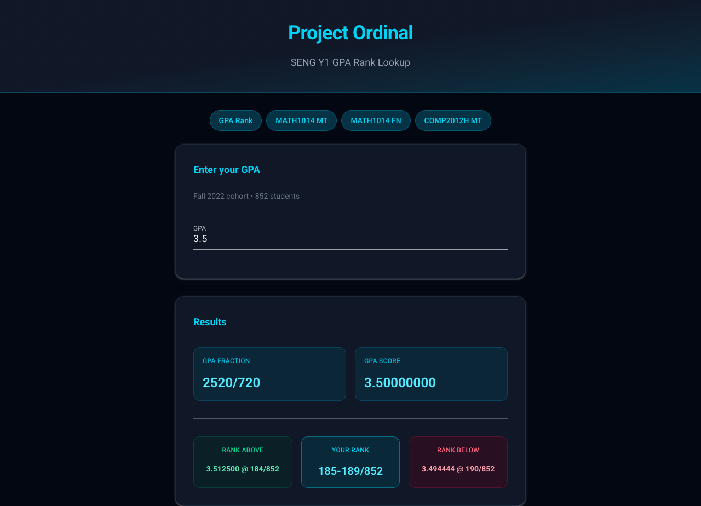
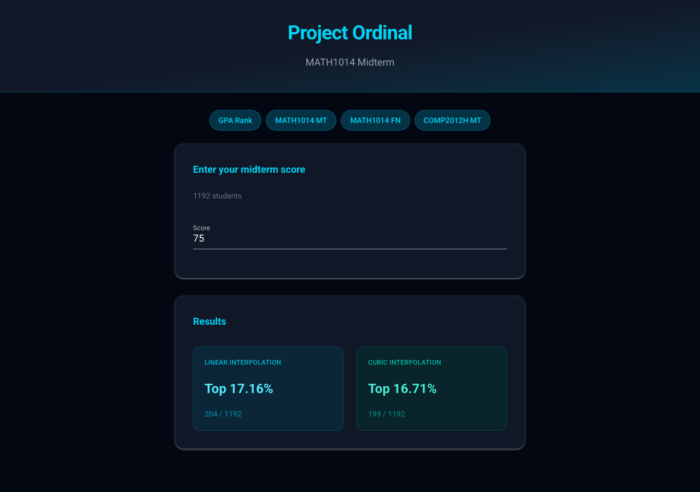

# Project Ordinal

A web application for HKUST SENG students to look up their GPA rank and exam score percentiles. Built with [NiceGUI](https://nicegui.io/).

## Pages

- **`/`** -- GPA rank lookup (Fall 2022 cohort, 852 students, 720-based fractions)
- **`/math1014mt`** -- MATH1014 Midterm score percentile (1192 students)
- **`/math1014fn`** -- MATH1014 Final score percentile (1192 students)
- **`/comp2012hmt`** -- COMP2012H Midterm score percentile (53 students)

## Screenshots

### GPA Rank Lookup

Enter your GPA to see your rank among 852 SENG Year 1 students, along with the nearest ranks above and below.



### Exam Score Percentile

Enter your exam score to see your percentile via both linear and cubic interpolation.



## Getting Started

### Prerequisites

- Python 3.10+
- pip

### Local Development

```bash
pip install -r requirements.txt
python serve_website.py
```

Then open [http://localhost:8080](http://localhost:8080).

### Docker

Build and run:

```bash
docker build -t project-ordinal .
docker run -p 8080:8080 project-ordinal
```

To run in detached mode:

```bash
docker run -d -p 8080:8080 project-ordinal
```

To map to a different host port (e.g. 3000):

```bash
docker run -p 3000:8080 project-ordinal
```

The app listens on port **8080** inside the container. No environment variables are needed -- all data is bundled in the image.

## Project Structure

| File | Description |
|------|-------------|
| `serve_website.py` | Main NiceGUI web application |
| `analyzer.py` | One-time script to extract CGA scores from the source PDF |
| `data_output.json` | Pre-extracted GPA ranking data (852 students) |
| `tests/test_app.py` | Async UI tests and unit tests |
| `pyproject.toml` | Ruff, mypy, and pytest configuration |

## Testing

```bash
pip install -r requirements.txt
python -m pytest tests/test_app.py -v
```

## Data Source

GPA rankings were extracted from `major_selection_briefing_2023_dragged.pdf` using `analyzer.py`, which parses scatter plot data points via [pdfminer](https://github.com/pdfminer/pdfminer.six) and calibrates pixel coordinates to CGA values using linear regression.
